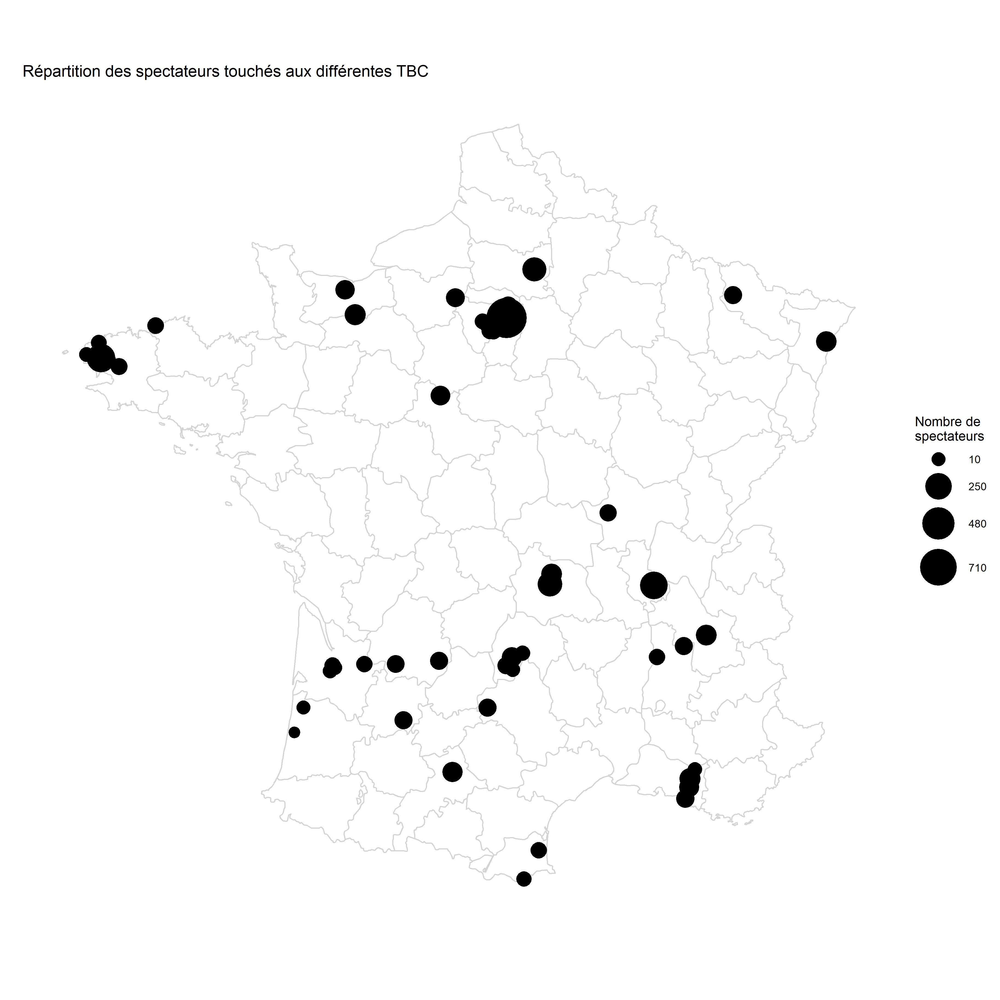

```{r setup, include=FALSE}
# packages
library(readr)
library(lubridate)
library(tidyverse)
library(knitr)
library(readxl)
library(rvest)
library(RCurl)
library(gsheet)
library(ggmap)
library(stringi)
# path
opts_knit$set(root.dir = normalizePath('../'))

opts_chunk$set(echo=FALSE, warning=FALSE, message=FALSE)
theme_set(theme_bw())

"%ni%" <- Negate("%in%")
```

```{r}

ceil_10 <- function(x){return(10*ceiling(x/10))}

```

```{r}
# install.packages('gsheet')


```

```{r scrap_data}

# Follow this procedure to scrap data: https://support.geckoboard.com/hc/en-us/articles/360015442912-How-to-create-a-direct-link-to-your-Google-Sheets-spreadsheet

# url_tbc_tracker <- "https://docs.google.com/spreadsheets/d/1rjMthAylnW4tFlA0Cj-tXt6MSRN8x14zYkx9M0-vA9w/export?format=xlsx" 
# download.file(url_tbc_tracker, destfile = "data/TBC_Tracker_scrapped.xlsx")


```


```{r read_data}
#Old way to dl
# data_raw <- readxl::read_xlsx("data/TBC_Tracker_scrapped.xlsx", sheet = 1)

data_raw <- gsheet2tbl('https://docs.google.com/spreadsheets/d/1rjMthAylnW4tFlA0Cj-tXt6MSRN8x14zYkx9M0-vA9w/edit#gid=0', sheetid = 1)
```


```{r}

data_work <- data_raw  %>% 
  mutate(Date = dmy(Date)) %>% 
  mutate(Annee = year(Date)) %>% 
  mutate(Ville = toupper(Ville)) %>%  #Mettre villes en majuscules
  mutate(Ville = stringi::stri_trans_general(Ville, "Latin-ASCII")) %>% #Supprimer accents
  mutate(Ville = str_replace_all(Ville, " ", "-")) %>% #remplacer les espaces par des tirets
  mutate(Ville = str_replace(Ville, "ST-", "SAINT-")) %>% 
  rename(dep = `Département (Numéro)`) %>% 
  rename(Academy = `Numéro ACademy (à laquelle a participé le conférencier)`) %>%
  # mutate(Academy = factor(Academy)) %>% 
  mutate(`Type de lieu` = str_to_title(`Type de lieu`)) #Premiere lettre en majuscule

#Liste de villes distinctes
data_cities <- data_work %>%
  distinct(Ville, dep) %>% 
  mutate(Ville = stringi::stri_trans_general(Ville, "Latin-ASCII")) %>% #Supprimer accents
  mutate(Ville = str_replace_all(Ville, " ", "-")) %>% #remplacer les espaces par des tirets
  mutate(Ville = str_replace(Ville, "ST-", "SAINT-"))
  

data_gps <- read_rds("data/gps_cities.rds") %>%
  as_tibble() %>%
  mutate(article = as.character(article), com_nom = as.character(com_nom)) %>%
  rename(Ville = com_nom)

#Coordonnées gps des villes où il y a eu les big conf
cities_coordinates <- data_cities %>%
  left_join(data_gps) %>% 
  select(Ville, article, long, lat)

# SAINT QUENTIN non present en BDD
cities_coordinates[which(cities_coordinates$Ville == "SAINT-QUENTIN-EN-YVELINES" ), c("long", "lat")] <- c(2.029,48.773)


cities_na <- cities_coordinates %>% 
  filter(is.na(long)) %>% pull(Ville) 

# print(cities_na)
```

```{r}
nb_spectateurs_annee <- data_work %>% group_by(Annee) %>% summarise(nb = sum(`Nombre de personnes`))
```

En 2019, `r nb_spectateurs_annee %>% filter(Annee == '2019') %>% pull(nb)` personnes ont assisté à des conférences d'Avenir Climatique.

Voici l'évolution du nombre de personnes qui ont assisté aux TBC en fonction des années:

```{r}
nb_spectateurs_annee %>% 
  ggplot(aes(x = Annee, y = nb)) +
  geom_point() +
  geom_line() +
  theme_bw() +
  scale_x_continuous(breaks = seq(from = min(nb_spectateurs_annee$Annee, na.rm = TRUE),
                                  to = max(nb_spectateurs_annee$Annee, na.rm = TRUE),
                                  by = 1))
```

Voici une carte de France des spectateurs de la TBC.



```{r, fig.height=21, fig.width=21}

data_shape <- map_data("france") %>%
  filter(!region %in% c("Haute-Corse","Corse du Sud"))

data_map <- data_work %>% left_join(cities_coordinates)

data_plot_villes <- data_map %>%
      group_by(Ville, long, lat) %>%
      summarise(nb_spectateurs =  sum(`Nombre de personnes`)) %>%
  ungroup()
plot_sampling <- ggplot() +
  geom_path(
    aes(long, lat, group=group),
    data=data_shape, color="lightgray"
  ) +
  geom_point(
    aes(long, lat, size = nb_spectateurs),
    data=data_plot_villes
  )+ 
  guides(size = guide_legend(title="Nombre de\nspectateurs")) +
  theme(legend.text=element_text(size=16),
        legend.title = element_text(size = 16),
        title = element_text(size = 16)) +
  coord_quickmap() +
  labs(y="Lattitude (°)", x="Longitude (°)") + 
  ggtitle("Répartition des spectateurs touchés aux différentes TBC") + 
  theme_minimal() + 
  scale_size_continuous(range = c(4,15),breaks = ceil_10(seq(min(data_plot_villes$nb_spectateurs, na.rm = T) %>% ceil_10, max(data_plot_villes$nb_spectateurs, na.rm = T), length.out = 5 ) ) ) + 
  scale_x_continuous(breaks = NULL) + 
  scale_y_continuous(breaks = NULL) +
  labs(x = "", y = "")

# plot_sampling

plot_sampling %>% ggsave(plot = ., filename = "map_conferences.jpg", path = "R/figures" , units = "cm", width = 29, height = 29, dpi = "retina")
```

Des conférences ont eu lieu dans des villes dont nous n'avons pas les coordonnées et que nous ne pouvons donc pas représenter:


`r kable(cities_na, col.names = NULL)`

```{r}

nb_spectateurs_par_dep <- data_work %>%
  ggplot(aes(x = factor(dep), y = `Nombre de personnes`)) +
  geom_col(aes(col = `Type de public`, fill = `Type de public`)) + 
  theme(axis.text.x = element_text(angle = 60, size = 6, hjust = 0.5, vjust = 0.5)) + 
  ggtitle("Nombre de personnes touchées par département") +
  labs(x = "Département")

nb_spectateurs_par_dep
nb_spectateurs_par_dep %>% ggsave(plot = ., filename = "hist_spectateurs.jpg", path = "R/figures" , units = "cm", width = 29, height = 29, dpi = "retina")
```

Nombre de spectateurs touchés par type de lieu.

```{r}

data_work %>%
  group_by(`Type de lieu`) %>% 
  summarise(`Nombre de spectateurs` = sum(`Nombre de personnes`)) %>% 
  ungroup %>% 
  ggplot( aes(x=fct_reorder(`Type de lieu`, `Nombre de spectateurs`),
              #Ordonner le facteur Type de lieu par nombre de spectateurs
              #pour améliorer l'ordre d'apparition dans le graphique
              y=`Nombre de spectateurs`)) + 
  geom_point(size=3) + 
  geom_segment(aes(x=fct_reorder(`Type de lieu`, `Nombre de spectateurs`), 
                   xend=`Type de lieu`, 
                   y=0, 
                   yend=`Nombre de spectateurs`)) + 
  labs(title="Nombre de spectateurs par type de lieu", x = "Type de lieu") + 
  theme(axis.text.x = element_text(angle=65, vjust=0.6))

```


# Academy 4
```{r}


data_map <- data_work %>%
  left_join(cities_coordinates) 
# %>% 
#   filter(`Numéro ACademy (à laquelle a participé le conférencier)` == 4) 

data_plot_villes <- data_map %>%
      group_by(Ville,Academy, long, lat) %>%
      summarise(nb_spectateurs =  sum(`Nombre de personnes`)) %>%
  ungroup()
plot_sampling <- ggplot() +
  geom_path(
    aes(long, lat, group=group),
    data=data_shape, color="lightgray"
  ) +
  geom_point(
    aes(long, lat, size = nb_spectateurs, color =factor(Academy)),
    data=data_plot_villes
  ) +
  guides(size = guide_legend(title="Nombre de\nspectateurs")) +
  theme(legend.text=element_text(size=16),
        legend.title = element_text(size = 16),
        title = element_text(size = 16)) +
  coord_quickmap() +
  labs(y="Lattitude (°)", x="Longitude (°)") + 
  ggtitle("Répartition des spectateurs touchés aux différentes TBC") + 
  theme_minimal() + 
  scale_size_continuous(breaks = ceil_10(seq(min(data_plot_villes$nb_spectateurs, na.rm = T) %>% ceil_10, max(data_plot_villes$nb_spectateurs, na.rm = T), length.out = 5 ) ) ) + 
  scale_x_continuous(breaks = NULL) + 
  scale_y_continuous(breaks = NULL) +
  labs(x = "", y = "")


```


