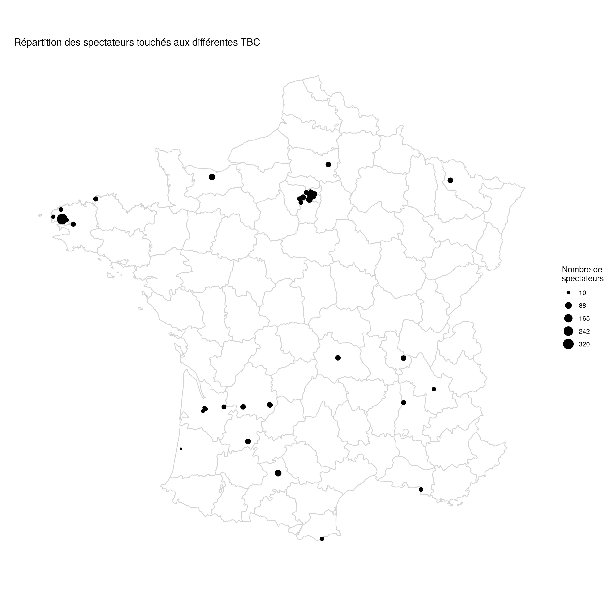

```{r setup, include=FALSE}
# packages
library(readr)
library(lubridate)
library(tidyverse)
library(knitr)
library(gsheet)
library(stringi)
# path
opts_knit$set(root.dir = normalizePath('../'))

opts_chunk$set(echo=FALSE, warning=FALSE, message=FALSE)
theme_set(theme_bw())

"%ni%" <- Negate("%in%")
```


```{r}
data_work <- read_rds("data/data_work.rds")
```


```{r}

ceil_10 <- function(x){return(10*ceiling(x/10))}

```


## Nombre de personnes sensibilisées


```{r}
nb_spectateurs_annee <- data_work %>% group_by(Annee) %>% summarise(nb = sum(`Nombre de personnes`))
```


Voici l'évolution du nombre de personnes qui ont assisté aux TBC en fonction des années:

```{r}
nb_spectateurs_annee %>% 
  mutate(Annee = as.numeric(as.character(Annee))) %>% 
  ggplot(aes(x = Annee, y = nb)) +
  geom_point() +
  geom_line() +
  theme_bw() +
  scale_y_continuous(breaks = seq(from = 0, to = max(nb_spectateurs_annee$nb), by = 200)) +
  labs(y = "Nombre de personnes sensibilisées")+
  ggtitle("Nombre de personnes sensibilisées par an")


```

On note une forte augmentation du nombre de personnes sensibilisées. La chute observée en 2020 s'explique par:

1. L'année n'est pas terminée à l'heure où j'écris ces lignes
2. La crise du Covid-19 met à mal certaines tenues de conférences


En 2019, `r nb_spectateurs_annee %>% filter(Annee == '2019') %>% pull(nb)` personnes ont assisté à des conférences d'Avenir Climatique.


Regardons le nombre de personnes sensibilisées par département:

```{r}

nb_spectateurs_par_dep  <- data_work %>%
  mutate(dep = fct_reorder(factor(dep),`Nombre de personnes`, sum, .desc = TRUE, na.rm = FALSE)) %>% 
  ggplot(aes(x = factor(dep), y = `Nombre de personnes`)) +
  # geom_col(aes(col = `Type de public`, fill = `Type de public`)) +
  geom_col(aes(col = Annee, fill = Annee)) +
  theme(axis.text.x = element_text(angle = 60, size = 6, hjust = 0.5, vjust = 0.5)) + 
  ggtitle("Nombre de personnes touchées par département") +
  labs(x = "Département")+
  guides(color = guide_legend(title = "Annee"))


nb_spectateurs_par_dep
nb_spectateurs_par_dep %>% ggsave(plot = ., filename = "hist_spectateurs.jpg", path = "R/figures" , units = "cm", width = 29, height = 29, dpi = "retina")
```


```{r, eval = FALSE}

nb_spectateurs_par_conferencier  <- data_work %>%
  mutate(Noms = fct_reorder(factor(Noms),`Nombre de personnes`, sum, .desc = TRUE, na.rm = FALSE)) %>% 
  ggplot(aes(x = Noms, y = `Nombre de personnes`)) +
  # geom_col(aes(col = `Type de public`, fill = `Type de public`)) +
  geom_col(aes(col = Annee, fill = Annee)) +
  theme(axis.text.x = element_text(angle = 60, size = 6, hjust = 0.5, vjust = 0.5)) + 
  ggtitle("Nombre de personnes touchées par conférencie.r.e(s)") +
  labs(x = "Département")+
  guides(color = guide_legend(title = "Annee"))

```

Les conférences ont principalement sensibilisé des parisiens, même si d'autres départements ont aussi eu pas mal de spectateurs (Finistère, Rhône etc.).


```{r}


#Liste de villes distinctes
data_cities <- data_work %>%
  distinct(Ville, dep) %>% 
  mutate(Ville = stringi::stri_trans_general(Ville, "Latin-ASCII")) %>% #Supprimer accents
  mutate(Ville = str_replace_all(Ville, " ", "-")) %>% #remplacer les espaces par des tirets
  mutate(Ville = str_replace(Ville, "ST-", "SAINT-"))
  
data_gps <- read_rds("data/gps_cities.rds") %>%
  as_tibble() %>%
  mutate(article = as.character(article), com_nom = as.character(com_nom)) %>%
  rename(Ville = com_nom)

#Coordonnées gps des villes où il y a eu les big conf
cities_coordinates <- data_cities %>%
  left_join(data_gps) %>% 
  select(Ville, article, long, lat)

# SAINT QUENTIN non present en BDD
cities_coordinates[which(cities_coordinates$Ville == "SAINT-QUENTIN-EN-YVELINES" ), c("long", "lat")] =list(long = 2.029, lat = 48.773)


cities_na <- cities_coordinates %>% 
  filter(is.na(long), !is.na(Ville)) %>% pull(Ville) 


```

Voici une carte de France des spectateurs de la TBC.



```{r, fig.height=21, fig.width=21}

data_shape <- map_data("france") %>%
  filter(!region %in% c("Haute-Corse","Corse du Sud"))

data_map <- data_work %>% left_join(cities_coordinates)

data_plot_villes <- data_map %>%
      group_by(Ville, long, lat) %>%
      summarise(nb_spectateurs =  sum(`Nombre de personnes`)) %>%
  ungroup()
plot_sampling <- ggplot() +
  geom_path(
    aes(long, lat, group=group),
    data=data_shape, color="lightgray"
  ) +
  geom_point(
    aes(long, lat, size = nb_spectateurs),
    data=data_plot_villes
  )+ 
  guides(size = guide_legend(title="Nombre de\nspectateurs")) +
  theme(legend.text=element_text(size=16),
        legend.title = element_text(size = 16),
        title = element_text(size = 16)) +
  coord_quickmap() +
  labs(y="Lattitude (°)", x="Longitude (°)") + 
  ggtitle("Répartition des spectateurs touchés aux différentes TBC") + 
  theme_minimal() + 
  scale_size_continuous(range = c(4,15),breaks = ceil_10(seq(min(data_plot_villes$nb_spectateurs, na.rm = T) %>% ceil_10, max(data_plot_villes$nb_spectateurs, na.rm = T), length.out = 5 ) ) ) + 
  scale_x_continuous(breaks = NULL) + 
  scale_y_continuous(breaks = NULL) +
  labs(x = "", y = "")

# plot_sampling

plot_sampling %>% ggsave(plot = ., filename = "map_conferences.jpg", path = "R/figures" , units = "cm", width = 29, height = 29, dpi = "retina")
```
On retrouve le grand nombre de personnes sensibilisées à Paris, ainsi que le Finistère. Certains départements de France pourraient être un peu plus sensibilisées également. Les départements de la fameuse "diagonale du vide" sont assez bien lotis en conférence. A l'inverse, certains départements ayant une forte densité n'ont pas eu de conférence d'Avenir Climatique, comme par exemple le Nord-Pas-de-Calais ou la Loire-Atlantique.


Des conférences ont eu lieu dans des villes dont nous n'avons pas les coordonnées et que nous ne pouvons donc pas représenter:


`r kable(cities_na, col.names = NULL)`

1 conférence à été faite en Espagne, une autre en Italie et une en visio, durant l'épidémie de Covid-19.


```{r}

nb_spectateurs_par_public  <- data_work %>%
  mutate(`Type de public` = fct_reorder(`Type de public`,`Nombre de personnes`, sum, .desc = TRUE, na.rm = FALSE)) %>% 
  ggplot(aes(x = `Type de public`, y = `Nombre de personnes`)) +
  # geom_col(aes(col = `Type de public`, fill = `Type de public`)) +
  geom_col(aes(col = Annee, fill = Annee)) +
  theme(axis.text.x = element_text(angle = 60, size = 6, hjust = 0.5, vjust = 0.5)) + 
  ggtitle("Nombre de personnes touchées par type de public") +
  labs(x = "Type de public")+
  guides(color = guide_legend(title = "Annee"))


nb_spectateurs_par_public
nb_spectateurs_par_public %>% ggsave(plot = ., filename = "hist_type_de_public.jpg", path = "R/figures" , units = "cm", width = 29, height = 29, dpi = "retina")
```

Les conférences sont principalement faites à des étudiant.e.s ou au grand public.


```{r}

# Rassembler des types de lieux qui se ressemblent (ex: Bar asso = Bar, Asso = Association)
data_work_lieu <- data_work %>%
  rowwise %>% 
  mutate(`Type de lieu` = case_when(str_detect(`Type de lieu`, "Bar") ~ "Bar",
                                    str_detect(`Type de lieu`, "Asso") ~ "Association",
                                    str_detect(`Type de lieu`, "ingé|Université") ~ "Université ou grande école",
                                    str_detect(`Type de lieu`, 'Google Meets|Twitch') ~ "Visio",
                                    str_detect(`Type de lieu`, 'Entreprise') ~ "Entreprise",
                                    str_detect(`Type de lieu`, 'Lycée') ~ "Lycée",
                                    str_detect(`Type de lieu`, 'Travail') ~ "Travail",
                                    str_detect(`Type de lieu`, 'Salle') ~ "Salle municipale",
                                    TRUE ~ `Type de lieu`)) %>% 
  ungroup

nb_spectateurs_par_lieu  <- data_work_lieu %>%
  mutate(`Type de lieu` = fct_reorder(`Type de lieu`,`Nombre de personnes`, sum, .desc = TRUE, na.rm = FALSE)) %>% 
  ggplot(aes(x = `Type de lieu`, y = `Nombre de personnes`)) +
  # geom_col(aes(col = `Type de public`, fill = `Type de public`)) +
  geom_col(aes(col = Annee, fill = Annee)) +
  theme(axis.text.x = element_text(angle = 60, size = 6, hjust = 0.5, vjust = 0.5)) + 
  ggtitle("Nombre de personnes touchées par type de lieu") +
  labs(x = "Type de lieu")+
  guides(color = guide_legend(title = "Annee"))


nb_spectateurs_par_lieu
nb_spectateurs_par_lieu %>% ggsave(plot = ., filename = "hist_type_de_lieu.jpg", path = "R/figures" , units = "cm", width = 29, height = 29, dpi = "retina")
```

Enfin, quand on observe la répartition du nombre de personnes touchées par type de lieu, on retrouve le fort nombre d'étudiant.e.s sensibilisé.e.s dans les universités ou grandes écoles. On note également le fort nombre de personnes sensibilisées par visio, avec comme unique année 2020, année de la pandémie de Covid19.

## Nombre de personnes par conférence

Regardons la répartition du nombre de spectateurs grâce à un diagramme dit "boîte à moustaches":

```{r}

data_work %>% 
  ggplot(aes(x = 0, y = `Nombre de personnes`))+
  geom_boxplot(aes(x = 0), outlier.shape = NA)+
  geom_jitter(alpha = 0.4, width = 0.04, aes(color = factor(Annee)))+
  scale_y_continuous(breaks = ceil_10(seq(0, ceil_10(max(data_work$`Nombre de personnes`)), length.out = 16) )) +
  theme(axis.text.x = element_blank(),
        axis.ticks.x = element_blank())+
  guides(color = guide_legend(title = "Annee"))

```

Globalement, les conférences réunissent aux alentours de 20-30 personnes. Cependant, de nombreuses coférences en réunissent plus.


On peut regarder le même graphique fait pour chaque année:

```{r}

data_work %>% 
  ggplot(aes(factor(Annee), y = `Nombre de personnes`))+
  geom_boxplot( outlier.shape = NA)+
  geom_jitter(alpha = 0.2, width = 0.04, aes(color = factor(Academy)))+
  scale_y_continuous(breaks = ceil_10(seq(0, max(data_work$`Nombre de personnes`), length.out = 8) )) +
  labs(x = "Annee")+
  # theme(axis.text.x = element_blank(),
  #       axis.ticks.x = element_blank())+
  guides(color = guide_legend(title = "Academy"))
```

On not une légère augmentation du nombre médian de personnes par conférence au cours des années.


<!-- ## Analyse de données -->

```{r, eval = FALSE}
library(FactoMineR)
```

```{r, eval = FALSE}

CA(table(data_work$dep, data_work$`Type de public`))


res.mca <- MCA(data_work %>% mutate(dep = as.factor(dep), Academy = as.factor(Academy)) %>% select(`Type de public`, dep,  Academy))

plot.MCA(res.mca, choix = "ind")

plot.MCA(res.mca, choix = "var")

```


```{r}
library(tm) # for text mining

library(wordcloud) #
```


```{r}

questions <- data_work %>% pull(`Questions posées par le public`)

questions <- VCorpus(VectorSource(questions))

questions <- questions %>%
  tm_map(removeNumbers) %>% 
  tm_map(removePunctuation) %>% 
  tm_map(stripWhitespace)

```

```{r, eval = FALSE}
questions_lower <- questions %>% tm_map(content_transformer(tolower))

questions_cleaned <- questions_lower %>% tm_map(removeWords, stopwords(kind = "fr")) %>% 
  tm_map(removeWords, c("comment", "estce", "quon", "quoi", "bah"))

questions_matrix <- TermDocumentMatrix(questions_cleaned) %>% as.matrix()

words_questions <- sort(rowSums(questions_matrix), decreasing=TRUE) 

head(words_questions, n = 10)

```

```{r, eval = FALSE}
df <- tibble(the_words = names(words_questions),freq = words_questions )

# head(df, n = 10)

wordcloud(df$the_words, df$freq)

```


```{r}

reactions <- data_work %>% pull(`Retour d'expérience`)

reactions <- VCorpus(VectorSource(reactions))

reactions <- reactions %>%
  tm_map(removeNumbers) %>% 
  tm_map(removePunctuation) %>% 
  tm_map(stripWhitespace)

reactions_lower <- reactions %>% tm_map(content_transformer(tolower))

reactions_cleaned <- reactions_lower %>% tm_map(removeWords, stopwords(kind = "fr"))

reactions_matrix <- TermDocumentMatrix(reactions_cleaned) %>% as.matrix()

words_reactions <- sort(rowSums(reactions_matrix), decreasing=TRUE) 
```


```{r, eval = FALSE}
df_reactions <- tibble(the_words = names(words_reactions),freq = words_reactions )

head(df_reactions, n = 10)

wordcloud(df_reactions$the_words, df_reactions$freq, scale = c(4,.1))

```

<!-- # Academy 4 -->
```{r, eval = FALSE}


data_map <- data_work %>%
  left_join(cities_coordinates) 
# %>% 
#   filter(`Numéro ACademy (à laquelle a participé le conférencier)` == 4) 

data_plot_villes <- data_map %>%
      group_by(Ville,Academy, long, lat) %>%
      summarise(nb_spectateurs =  sum(`Nombre de personnes`)) %>%
  ungroup()
plot_sampling <- ggplot() +
  geom_path(
    aes(long, lat, group=group),
    data=data_shape, color="lightgray"
  ) +
  geom_point(
    aes(long, lat, size = nb_spectateurs, color =factor(Academy)),
    data=data_plot_villes
  ) +
  guides(size = guide_legend(title="Nombre de\nspectateurs")) +
  theme(legend.text=element_text(size=16),
        legend.title = element_text(size = 16),
        title = element_text(size = 16)) +
  coord_quickmap() +
  labs(y="Lattitude (°)", x="Longitude (°)") + 
  ggtitle("Répartition des spectateurs touchés aux différentes TBC") + 
  theme_minimal() + 
  scale_size_continuous(breaks = ceil_10(seq(min(data_plot_villes$nb_spectateurs, na.rm = T) %>% ceil_10, max(data_plot_villes$nb_spectateurs, na.rm = T), length.out = 5 ) ) ) + 
  scale_x_continuous(breaks = NULL) + 
  scale_y_continuous(breaks = NULL) +
  labs(x = "", y = "")


```

